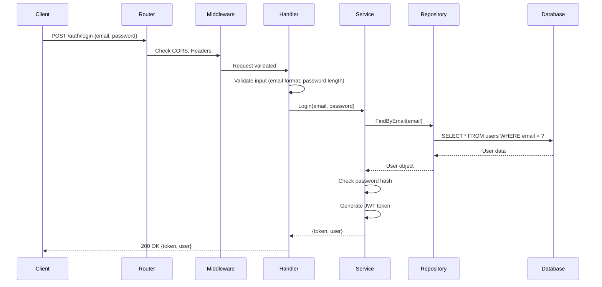

# 🎓 Beginner's Guide to bdSeeker Backend

Welcome! This guide will help you understand how this backend project works, even if you're new to backend development. We'll explain everything step by step with examples.

## 📚 Table of Contents

1. [What is This Project?](#what-is-this-project)
2. [Project Structure](#project-structure)
3. [Architecture Pattern (MVC)](#architecture-pattern-mvc)
4. [How an API Request Works](#how-an-api-request-works)
5. [Understanding Each Layer](#understanding-each-layer)
6. [Complete Example: User Login Flow](#complete-example-user-login-flow)
7. [Database & Models](#database--models)
8. [Common Patterns You'll See](#common-patterns-youll-see)
9. [How to Add a New Feature](#how-to-add-a-new-feature)

---

## 🎯 What is This Project?

**bdSeeker** is a job platform backend API built with Go (Golang). It allows:
- **Developers** to search for jobs, apply, and review companies
- **Companies** to post jobs and manage their profiles
- **Admins** to manage the platform, approve reviews, and handle reports

**Tech Stack:**
- **Language:** Go (Golang)
- **Framework:** Gorilla Mux (for routing)
- **Database:** PostgreSQL (using GORM ORM)
- **Authentication:** JWT (JSON Web Tokens)

---

## 📁 Project Structure

Here's how the project is organized:

```
bdSeeker-backend/
│
├── main.go                          # Entry point - starts the server
│
├── internal/                        # Private application code
│   ├── config/                      # Configuration (database, JWT settings)
│   │   └── config.go
│   │
│   ├── database/                    # Database connection & migrations
│   │   ├── database.go
│   │   └── seed.go
│   │
│   ├── models/                      # Data structures (database tables)
│   │   ├── user.go
│   │   ├── company.go
│   │   ├── developer.go
│   │   ├── job.go
│   │   └── review.go
│   │
│   ├── repositories/                # Database operations (CRUD)
│   │   ├── user_repository.go
│   │   ├── company_repository.go
│   │   ├── developer_repository.go
│   │   └── job_repository.go
│   │
│   ├── services/                    # Business logic
│   │   └── auth_service.go
│   │
│   ├── handlers/                    # HTTP request handlers (controllers)
│   │   ├── auth_handler.go
│   │   ├── company_handler.go
│   │   ├── developer_handler.go
│   │   ├── job_handler.go
│   │   └── admin_handler.go
│   │
│   └── middleware/                  # Request interceptors
│       ├── auth.go                  # Checks if user is logged in
│       ├── cors.go                  # Handles cross-origin requests
│       └── error.go                 # Error handling
│
├── pkg/                             # Reusable utilities
│   └── utils/                       # Helper functions
│       ├── jwt.go                   # Token generation/validation
│       ├── password.go              # Password hashing
│       ├── response.go              # JSON response helpers
│       └── validation.go            # Input validation
│
├── .env                             # Environment variables (secrets)
├── go.mod                           # Go dependencies
└── go.sum                           # Dependency checksums
```

### 🗂️ What Each Folder Does

| Folder | Purpose | Example |
|--------|---------|---------|
| **models/** | Defines database tables as Go structs | `User`, `Company`, `Job` |
| **repositories/** | Talks to the database (CRUD operations) | `CreateUser()`, `FindByEmail()` |
| **services/** | Contains business logic | `Register()`, `Login()` |
| **handlers/** | Receives HTTP requests, sends responses | `POST /auth/login` |
| **middleware/** | Runs before handlers (auth checks, logging) | Verify JWT token |
| **pkg/utils/** | Helper functions used everywhere | Hash password, generate JWT |

---

## 🏗️ Architecture Pattern (MVC)

This project uses a **layered architecture** similar to MVC (Model-View-Controller):

```
┌─────────────────────────────────────────────────────────────┐
│                         CLIENT                              │
│                  (Postman, Mobile App, Web)                 │
└────────────────────────┬────────────────────────────────────┘
                         │
                         │ HTTP Request (JSON)
                         ▼
┌─────────────────────────────────────────────────────────────┐
│                      MIDDLEWARE                             │
│              (Auth Check, CORS, Error Handling)             │
└────────────────────────┬────────────────────────────────────┘
                         │
                         ▼
┌─────────────────────────────────────────────────────────────┐
│                       HANDLER                               │
│           (Receives request, validates input)               │
│                   auth_handler.go                           │
└────────────────────────┬────────────────────────────────────┘
                         │
                         ▼
┌─────────────────────────────────────────────────────────────┐
│                       SERVICE                               │
│              (Business logic, orchestration)                │
│                   auth_service.go                           │
└────────────────────────┬────────────────────────────────────┘
                         │
                         ▼
┌─────────────────────────────────────────────────────────────┐
│                     REPOSITORY                              │
│              (Database queries using GORM)                  │
│                 user_repository.go                          │
└────────────────────────┬────────────────────────────────────┘
                         │
                         ▼
┌─────────────────────────────────────────────────────────────┐
│                      DATABASE                               │
│                     PostgreSQL                              │
└─────────────────────────────────────────────────────────────┘
```

### Why This Pattern?

- **Separation of Concerns:** Each layer has one job
- **Testable:** You can test each layer independently
- **Maintainable:** Easy to find and fix bugs
- **Scalable:** Easy to add new features

---

## 🔄 How an API Request Works

Let's trace what happens when a user tries to **login**:

### Step-by-Step Flow

```
1. User sends POST request to /api/v1/auth/login
   ↓
2. Router (main.go) matches the route
   ↓
3. Middleware checks if request is valid (CORS, etc.)
   ↓
4. Handler (auth_handler.go) receives the request
   ↓
5. Handler validates the input (email, password)
   ↓
6. Handler calls Service (auth_service.go)
   ↓
7. Service calls Repository to find user by email
   ↓
8. Repository queries the database
   ↓
9. Database returns user data
   ↓
10. Service verifies password hash
   ↓
11. Service generates JWT token
   ↓
12. Handler sends JSON response with token
   ↓
13. User receives response
```

### Visual Diagram



---

## 🧩 Understanding Each Layer

### 1️⃣ Models (Database Schema)

**Location:** `internal/models/`

Models define what data looks like in the database.

**Example:** `user.go`

```go
type User struct {
    ID           uint           `gorm:"primaryKey" json:"id"`
    Email        string         `gorm:"uniqueIndex;not null" json:"email"`
    PasswordHash string         `gorm:"not null" json:"-"`
    FullName     string         `json:"full_name"`
    Role         string         `json:"role"` // developer, company, admin
    CreatedAt    time.Time      `json:"created_at"`
    UpdatedAt    time.Time      `json:"updated_at"`
}
```

**What this means:**
- `ID`: Unique identifier (auto-incremented)
- `Email`: Must be unique, cannot be null
- `PasswordHash`: Stored securely, never sent in JSON (`json:"-"`)
- `Role`: User type (developer/company/admin)

---

### 2️⃣ Repositories (Database Operations)

**Location:** `internal/repositories/`

Repositories handle all database queries.

**Example:** `user_repository.go`

```go
type UserRepository struct {
    db *gorm.DB  // Database connection
}

// Create a new user in database
func (r *UserRepository) Create(user *models.User) error {
    return r.db.Create(user).Error
}

// Find user by email
func (r *UserRepository) FindByEmail(email string) (*models.User, error) {
    var user models.User
    err := r.db.Where("email = ?", email).First(&user).Error
    return &user, err
}

// Find user by ID
func (r *UserRepository) FindByID(id uint) (*models.User, error) {
    var user models.User
    err := r.db.First(&user, id).Error
    return &user, err
}
```

**Key Points:**
- Uses GORM (ORM library) to interact with PostgreSQL
- Each function does ONE database operation
- Returns errors if something goes wrong

---

### 3️⃣ Services (Business Logic)

**Location:** `internal/services/`

Services contain the "brain" of your application - the business rules.

**Example:** `auth_service.go`

```go
type AuthService struct {
    userRepo *repositories.UserRepository
}

func (s *AuthService) Login(req *LoginRequest) (*AuthResponse, error) {
    // Step 1: Find user by email
    user, err := s.userRepo.FindByEmail(req.Email)
    if err != nil {
        return nil, errors.New("invalid email or password")
    }

    // Step 2: Check if password is correct
    if !utils.CheckPassword(req.Password, user.PasswordHash) {
        return nil, errors.New("invalid email or password")
    }

    // Step 3: Generate JWT token
    token, err := utils.GenerateToken(user.ID, user.Email, user.Role)
    if err != nil {
        return nil, err
    }

    // Step 4: Return token and user info
    return &AuthResponse{
        Token: token,
        User:  user,
    }, nil
}
```

**What happens here:**
1. Check if user exists
2. Verify password (using bcrypt)
3. Create JWT token
4. Return token to user

---

### 4️⃣ Handlers (HTTP Controllers)

**Location:** `internal/handlers/`

Handlers receive HTTP requests and send responses.

**Example:** `auth_handler.go`

```go
type AuthHandler struct {
    authService *services.AuthService
}

func (h *AuthHandler) Login(w http.ResponseWriter, r *http.Request) {
    // Step 1: Parse JSON from request body
    var req services.LoginRequest
    if err := json.NewDecoder(r.Body).Decode(&req); err != nil {
        utils.RespondError(w, http.StatusBadRequest, "Invalid request body")
        return
    }

    // Step 2: Validate input
    if errors := utils.ValidateStruct(&req); errors != nil {
        utils.RespondValidationError(w, errors)
        return
    }

    // Step 3: Call service to handle login
    response, err := h.authService.Login(&req)
    if err != nil {
        utils.RespondError(w, http.StatusUnauthorized, err.Error())
        return
    }

    // Step 4: Send success response
    utils.RespondSuccess(w, "Login successful", response)
}
```

**Handler Responsibilities:**
1. Parse incoming JSON
2. Validate input
3. Call service layer
4. Send JSON response

---

### 5️⃣ Middleware (Request Interceptors)

**Location:** `internal/middleware/`

Middleware runs **before** your handler. Think of it as a security guard.

**Example:** `auth.go`

```go
func AuthMiddleware(next http.Handler) http.Handler {
    return http.HandlerFunc(func(w http.ResponseWriter, r *http.Request) {
        // Step 1: Get token from header
        token := r.Header.Get("Authorization")
        if token == "" {
            utils.RespondError(w, http.StatusUnauthorized, "No token provided")
            return
        }

        // Step 2: Validate token
        claims, err := utils.ValidateToken(token)
        if err != nil {
            utils.RespondError(w, http.StatusUnauthorized, "Invalid token")
            return
        }

        // Step 3: Add user info to request context
        ctx := context.WithValue(r.Context(), "user_id", claims.UserID)
        
        // Step 4: Continue to handler
        next.ServeHTTP(w, r.WithContext(ctx))
    })
}
```

**When to use middleware:**
- Authentication (check if user is logged in)
- Authorization (check if user has permission)
- Logging (record all requests)
- CORS (allow cross-origin requests)

---

## 🔐 Complete Example: User Login Flow

Let's walk through a **complete login request** with actual code:

### 1. Client Sends Request

```bash
POST http://localhost:8080/api/v1/auth/login
Content-Type: application/json

{
  "email": "developer@example.com",
  "password": "password123"
}
```

### 2. Router Matches Route

**File:** `main.go`

```go
api.HandleFunc("/auth/login", authHandler.Login).Methods("POST")
```

### 3. Handler Receives Request

**File:** `internal/handlers/auth_handler.go`

```go
func (h *AuthHandler) Login(w http.ResponseWriter, r *http.Request) {
    // Parse JSON body
    var req services.LoginRequest
    json.NewDecoder(r.Body).Decode(&req)
    
    // Validate
    if errors := utils.ValidateStruct(&req); errors != nil {
        utils.RespondValidationError(w, errors)
        return
    }
    
    // Call service
    response, err := h.authService.Login(&req)
    if err != nil {
        utils.RespondError(w, http.StatusUnauthorized, err.Error())
        return
    }
    
    // Send response
    utils.RespondSuccess(w, "Login successful", response)
}
```

### 4. Service Processes Login

**File:** `internal/services/auth_service.go`

```go
func (s *AuthService) Login(req *LoginRequest) (*AuthResponse, error) {
    // Find user
    user, err := s.userRepo.FindByEmail(req.Email)
    if err != nil {
        return nil, errors.New("invalid email or password")
    }
    
    // Check password
    if !utils.CheckPassword(req.Password, user.PasswordHash) {
        return nil, errors.New("invalid email or password")
    }
    
    // Generate token
    token, _ := utils.GenerateToken(user.ID, user.Email, user.Role)
    
    return &AuthResponse{Token: token, User: user}, nil
}
```

### 5. Repository Queries Database

**File:** `internal/repositories/user_repository.go`

```go
func (r *UserRepository) FindByEmail(email string) (*models.User, error) {
    var user models.User
    err := r.db.Where("email = ?", email).First(&user).Error
    return &user, err
}
```

**SQL Generated by GORM:**
```sql
SELECT * FROM users WHERE email = 'developer@example.com' LIMIT 1;
```

### 6. Response Sent Back

```json
{
  "success": true,
  "message": "Login successful",
  "data": {
    "token": "eyJhbGciOiJIUzI1NiIsInR5cCI6IkpXVCJ9...",
    "user": {
      "id": 1,
      "email": "developer@example.com",
      "full_name": "John Developer",
      "role": "developer"
    }
  }
}
```

---

## 🗄️ Database & Models

### How GORM Works

GORM is an ORM (Object-Relational Mapping) library. It converts Go structs to database tables.

**Go Struct:**
```go
type User struct {
    ID        uint      `gorm:"primaryKey"`
    Email     string    `gorm:"uniqueIndex;not null"`
    FullName  string
    CreatedAt time.Time
}
```

**Database Table:**
```sql
CREATE TABLE users (
    id SERIAL PRIMARY KEY,
    email VARCHAR(255) UNIQUE NOT NULL,
    full_name VARCHAR(255),
    created_at TIMESTAMP
);
```

### Common GORM Operations

```go
// Create
db.Create(&user)

// Find by ID
db.First(&user, 1)

// Find by condition
db.Where("email = ?", "test@example.com").First(&user)

// Update
db.Save(&user)

// Delete
db.Delete(&user)

// Find all with pagination
db.Offset(10).Limit(20).Find(&users)
```

---

## 🔧 Common Patterns You'll See

### 1. Dependency Injection

Instead of creating objects inside functions, we pass them in:

```go
// ❌ Bad: Creates dependency inside
func NewAuthHandler() *AuthHandler {
    userRepo := repositories.NewUserRepository()  // Hard to test
    authService := services.NewAuthService(userRepo)
    return &AuthHandler{authService: authService}
}

// ✅ Good: Receives dependency
func NewAuthHandler(authService *services.AuthService) *AuthHandler {
    return &AuthHandler{authService: authService}
}
```

**Why?** Makes testing easier and code more flexible.

### 2. Error Handling

Go uses explicit error handling:

```go
user, err := userRepo.FindByEmail(email)
if err != nil {
    return nil, err  // Return error to caller
}
// Continue if no error
```

### 3. Pointer vs Value

```go
// Pointer (*User) - can modify original
func UpdateUser(user *User) {
    user.FullName = "New Name"  // Changes original
}

// Value (User) - creates copy
func PrintUser(user User) {
    user.FullName = "New Name"  // Only changes copy
}
```

### 4. JSON Tags

```go
type User struct {
    ID           uint   `json:"id"`              // Sent as "id" in JSON
    PasswordHash string `json:"-"`               // Never sent in JSON
    FullName     string `json:"full_name"`       // Sent as "full_name"
}
```

---

## 🚀 How to Add a New Feature

Let's say you want to add a **"Get User Profile"** endpoint.

### Step 1: Define the Model (if needed)

Already exists in `internal/models/user.go`

### Step 2: Add Repository Method

**File:** `internal/repositories/user_repository.go`

```go
func (r *UserRepository) FindByID(id uint) (*models.User, error) {
    var user models.User
    err := r.db.First(&user, id).Error
    return &user, err
}
```

### Step 3: Add Service Method

**File:** `internal/services/auth_service.go`

```go
func (s *AuthService) GetUserProfile(userID uint) (*models.User, error) {
    return s.userRepo.FindByID(userID)
}
```

### Step 4: Add Handler

**File:** `internal/handlers/auth_handler.go`

```go
func (h *AuthHandler) GetProfile(w http.ResponseWriter, r *http.Request) {
    // Get user ID from URL
    vars := mux.Vars(r)
    userID, _ := strconv.ParseUint(vars["id"], 10, 32)
    
    // Get profile
    user, err := h.authService.GetUserProfile(uint(userID))
    if err != nil {
        utils.RespondError(w, http.StatusNotFound, "User not found")
        return
    }
    
    utils.RespondSuccess(w, "Profile retrieved", user)
}
```

### Step 5: Register Route

**File:** `main.go`

```go
api.HandleFunc("/users/{id}", authHandler.GetProfile).Methods("GET")
```

### Step 6: Test It!

```bash
GET http://localhost:8080/api/v1/users/1
```

---

## 📝 Summary

### Key Takeaways

1. **Layered Architecture:** Handler → Service → Repository → Database
2. **Each layer has ONE job:** Don't mix concerns
3. **Follow the flow:** Request → Middleware → Handler → Service → Repository → Database
4. **Use GORM for database:** No need to write raw SQL
5. **Always handle errors:** Check `if err != nil`
6. **Use middleware for common tasks:** Auth, logging, CORS

### File Structure Recap

```
Request comes in
    ↓
main.go (routes the request)
    ↓
middleware/ (checks auth, CORS)
    ↓
handlers/ (receives request, validates input)
    ↓
services/ (business logic)
    ↓
repositories/ (database queries)
    ↓
models/ (database structure)
    ↓
Database (PostgreSQL)
```

### Next Steps

1. Read `main.go` to see how routes are set up
2. Pick one feature (like login) and trace through all layers
3. Try adding a simple endpoint yourself
4. Read the existing code in `handlers/`, `services/`, and `repositories/`
5. Check out the Postman collections to test APIs

---

## 🆘 Need Help?

- **GORM Documentation:** https://gorm.io/docs/
- **Gorilla Mux:** https://github.com/gorilla/mux
- **Go by Example:** https://gobyexample.com/

Happy coding! 🎉
